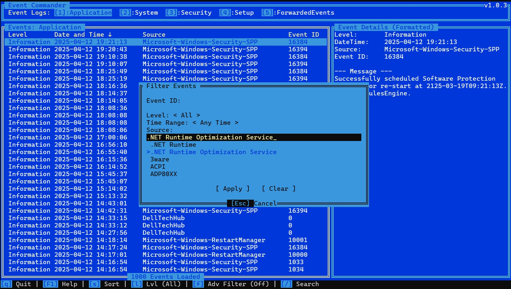

# Event Commander

## Overview

Event Commander is a terminal-based event viewer for Windows, written in Rust. It provides a user experience reminiscent of classic file managers like Norton Commander, allowing users to navigate and view Windows Event Logs efficiently using keyboard controls within a TUI (Text-based User Interface).



## Features

- **Log Selection:** Select from standard Windows Event Logs (Application, System, Security, Setup, ForwardedEvents).
- **Event Listing:** View events from the selected log in a table format (Level, DateTime, Source, Event ID).
- **Filtering & Sorting:** Filter events by Level, Source, Event ID, and Date range. Sort events by DateTime or Event ID.
- **Event Details:** View detailed formatted event messages and the raw event XML.
- **XML Pretty Printing:** The raw XML view is automatically pretty-printed for readability.
- **Save Event:** Save the full, pretty-printed XML of the selected event to a local file.
- **Dynamic Loading:** Events are fetched in batches as you scroll down the event list.
- **Keyboard Navigation:** Use arrow keys, PageUp/Down, Home/End, Tab/BackTab, and specific function keys (like F1 for Help, f for Filter) for navigation and interaction.
- **Theming:** Includes a Norton Commander inspired theme.

## Building and Running

1.  **Prerequisites:**
    - Install Rust and Cargo: [https://www.rust-lang.org/tools/install](https://www.rust-lang.org/tools/install)
    - Install Windows SDK on your Windows system
    - Install MinGW-w64 toolchain in WSL:
      ```bash
      sudo apt-get update && sudo apt-get install -y mingw-w64 gcc-mingw-w64-x86-64 g++-mingw-w64-x86-64
      ```
2.  **Clone the repository:**
    ```bash
    git clone https://github.com/Dastari/event_commander
    cd event-commander
    ```
3.  **Build:**
    ```bash
    cargo build --target x86_64-pc-windows-msvc --release
    ```
    _Note: Building `windows-rs` can take some time, especially the first time._
4.  **Run:**
    ```bash
    cargo run --target x86_64-pc-windows-msvc --release
    ```
    Alternatively, run the compiled executable directly:
    ```bash
    ./target/x86_64-pc-windows-msvc/release/event_commander.exe
    ```

### Precompiled Binary (Windows)

For convenience, a precompiled binary for Windows (`x86_64-pc-windows-msvc` target) is available for the latest release:

- **[v1.0.3 Download](https://github.com/Dastari/event_commander/releases/download/v1.0.3/event_commander.exe)**

Simply download the `.exe` file and run it.
